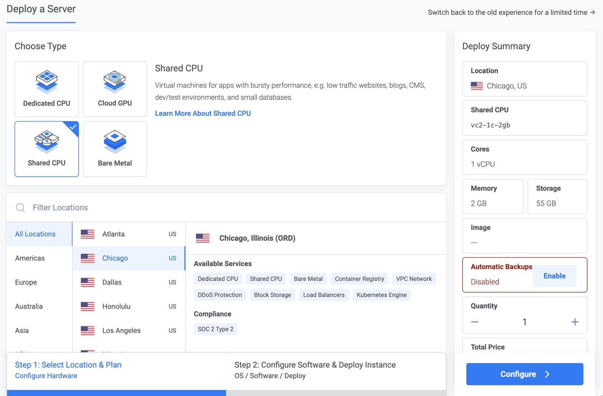
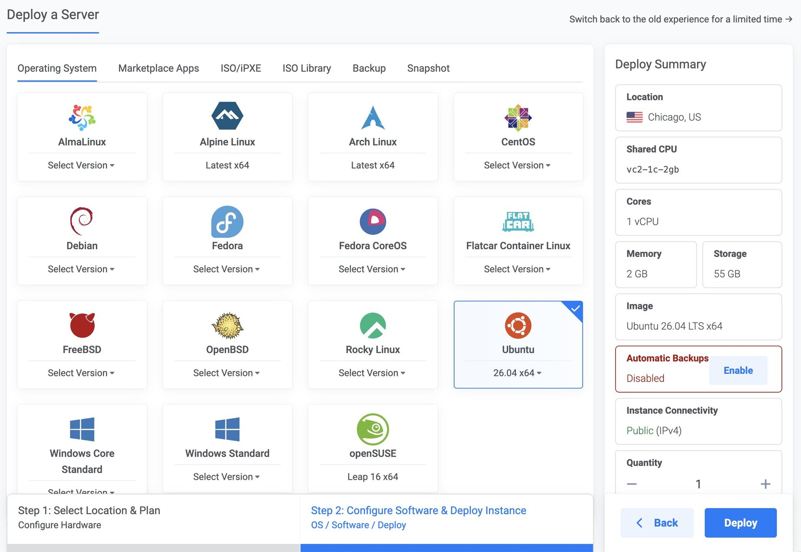
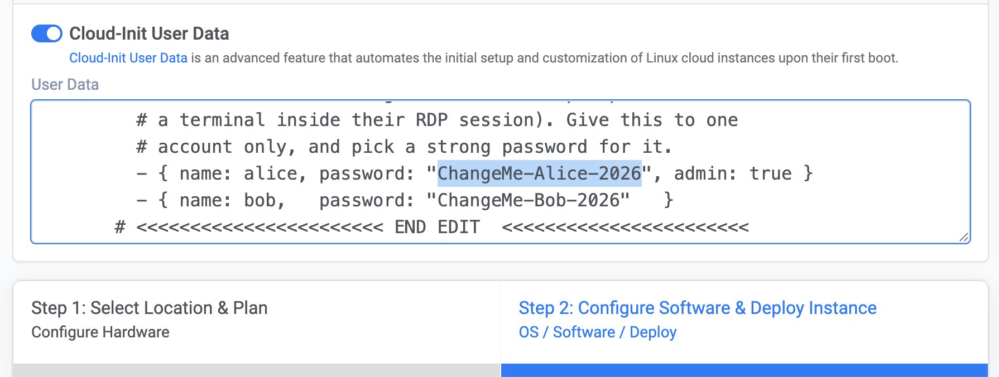
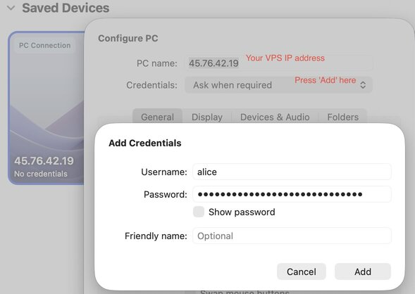
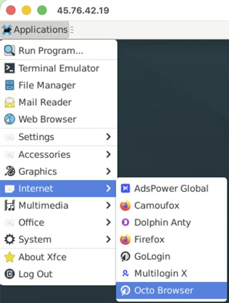

<div align="center">

**A Windows-style remote desktop on a cloud VM, sitting next to your mobile proxies.**

</div>

## Quickstart

You'll do this once per VM, in about five minutes.

### 1. Grab the file

Open [`cloud-init.yml`](cloud-init.yml) → click **Raw** → **Ctrl-A, Ctrl-C**.

Paste it into a text editor (Notepad is fine) and edit the block marked **`EDIT HERE`**:

```yaml
xrdp_users:
  - { name: alice, password: "ChangeMe-Alice-2026", admin: true }
```

Pick strong, unique passwords — these accounts log in over the plain internet.

Select _all → copy again_. You'll paste this edited version below.

---

### 2. Create the VM

Pick your provider. Same shape everywhere: Ubuntu 26.04 (24.04 should work too), ≥ 2 GB RAM per concurrent user, paste the file into "User Data".

> ### Where should the VM live?
> **Close to your proxies (the phones)** — same state where possible, or within roughly **200–500 km**.

<details open>
<summary><b>Vultr</b> — recommended, widest choice of locations</summary>

1. **Deploy → Deploy New Server**
2. **Server Type** — Cloud Compute
3. **Location** — datacentre nearest the phones · **Plan** — at least 2 GB RAM per user

   
4. **Image** — Ubuntu **26.04 LTS x64**

   
5. Scroll to **Additional Features** → toggle on **Cloud-Init User Data** → paste your edited file

   
6. **Deploy Now** → wait ~5 min after it shows **Running**

</details>

<details>
<summary><b>DigitalOcean</b></summary>

1. **Create → Droplets**
2. **Region** — datacentre nearest the phones
3. **OS** — Ubuntu **26.04 (LTS) x64**
4. **Size** — at least 2 GB RAM per user
5. **Authentication** — root password is fine; you won't use SSH
6. Open **Advanced options** → tick **Add Initialization scripts (cloud-init)** → paste your edited file
7. **Create Droplet** → wait ~5 min after it shows **Active**

</details>

<details>
<summary><b>Hetzner Cloud</b></summary>

1. **+ Add Server**
2. **Location** — datacentre nearest the phones
3. **Image** — Ubuntu **26.04**
4. **Type** — at least 2 GB RAM (CX22 or larger)
5. Scroll to **Cloud config** → paste your edited file
6. **Create & Buy now** → wait ~5 min after the green dot appears

</details>

> **Any other provider** (AWS, Azure, GCP, OVH, Linode…) works too — any "User Data" / "Custom data" / "Startup script" field on a fresh Ubuntu 26.04 VM accepts the same paste.

---

### 3. Connect

Wait until ~5 minutes after boot. Then:

| Client OS | App | Where to put the host |
|---|---|---|
| Windows | Remote Desktop Connection (`mstsc`) | `<vm-public-ip>` (default RDP port 3389) |
| macOS | Microsoft Remote Desktop (App Store) | Add PC → same host |
| iOS / Android | **RD Client** | Add PC → same host |
| Linux | Remmina / FreeRDP | Same host |

Username + password are the ones from your `cloud-init.yml`.

<details open>
<summary><b>Example — macOS Microsoft Remote Desktop</b></summary>

Add PC → enter the VM's public IP as **PC name** → next to **Credentials** click **Add…** → enter your `xrdp_users` username and password.



</details>

---

## What's next?

You've got a working Linux desktop. Two pointers:

- **Antidetect browser** — six come preinstalled, ready in **Applications → Internet**: **AdsPower Global**, **Camoufox**, **Dolphin Anty**, **GoLogin**, **Multilogin X**, **Octo Browser** (plus regular **Firefox**).

  
  
  Other majors with Linux builds you can add yourself: **Indigo**, **Incogniton**. The notable holdouts are **Linken Sphere** and **Kameleo** — Windows/Mac only.
  
- **Everything else** — ask ChatGPT. "I'm on Ubuntu 26.04 XFCE, how do I X?" handles install/config grunt-work just fine. :)

---

## Advanced — Already have an Ubuntu 26.04 VM or want to reconfigure?

SSH in and:

```bash
git clone https://github.com/iproxy-online/rdp-vm-guide.git
cd rdp-vm-guide
sudo ./setup-and-run.sh
```

You'll be asked for the RDP port, source CIDR, and a comma-separated user list. Set passwords afterwards with `sudo passwd <name>`.

---

## Troubleshooting

| Symptom | Most likely cause |
|---|---|
| **Can't connect at all** | Provider's outer firewall blocks `rdp_port` (UFW alone can't help). Open inbound TCP on it. |
| **Wrong password** | You pasted `cloud-init.yml` before editing it. Destroy the VM, edit, retry. |
| **Connect → black screen** | First-run XFCE setup. Wait a minute, reconnect. |
| **Laggy when using a proxy** | VM is too far from the phones. Move the VM, not the client. |
